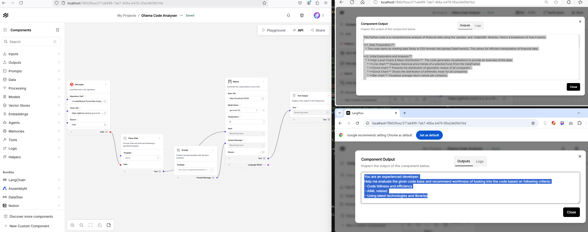

# langflow
langflow

### Prerequisites
- Python 3.10 or higher
- Git

### Installation langflow on docker desktop
Prerequisites 
- docker-desktop

Step 1 : Pull the Langflow Docker Image
```bash
docker pull langflowai/langflow
```

Step 2: Run Langflow Docker Image
```bash
docker run -it --rm -p 7860:7860 langflowai/langflow:latest
```
or if you want to keep the container
```bash
docker run -it -p 7880:7860 langflowai/langflow:latest
```
The -p 7860/7880:7860 flag maps port 7860 of the container to port 7860/7880 on your host machine.
The optional --rm flag ensures the container is removed after it stops.

### Installation langflow 1.2.0 with uv
Create a virtual environment :
```bash
conda create --name langflow120  python=3.12
conda activate langflow120
```

Install the required dependencies in the virtual environment :
```bash
pip install uv==0.5.26
uv pip install langflow==1.2.0
```


### Installation langflow 1.1.1 with pip
Clone the repository :
```bash
git clone https://github.com/ly2xxx/langflow.git
```

Navigate to the project directory :
```bash
cd langflow
```

Create a virtual environment :
```bash
python -m venv .venv
.\.venv\Scripts\activate
```

Install the required dependencies in the virtual environment :
```bash
pip install langflow==1.1.1 --use-deprecated=legacy-resolver
```
or
```bash
python -m pip install langflow==1.1.1 -U  --use-deprecated=legacy-resolver --no-build-isolation
```

If you encounter timeout, try to increase timeout threshold
```bash
pip install langflow==1.1.1 --default-timeout=1000 --use-deprecated=legacy-resolver --no-build-isolation
```

### Run the app :
```bash
python -m langflow run
```




# Reference
Official documentation - https://docs.langflow.org/get-started-quickstart

Official repository - https://github.com/langflow-ai/langflow 

Huggingface playground - https://huggingface.co/Langflow

<!-- Demo - https://www.youtube.com/watch?v=xD43xUC_LWI&t=172s -->
[](https://www.youtube.com/watch?v=xD43xUC_LWI)

[](https://youtu.be/RWo4GDTZIsE)

[](https://youtu.be/QmUsG_3wHPg)
https://github.com/techwithtim/Langflow-Customer-Support-Agent

[](https://m.youtube.com/watch?v=Nyg8-8f-ScQ)

[](https://m.youtube.com/watch?v=L94WBLL0KjY)

[](https://m.youtube.com/watch?v=K1Zy8lPl9BM)

[](https://m.youtube.com/watch?v=vi40dn79Zgw)


JAVA client chatbot - https://github.com/aar0np/workshop_ecommerce_prototype/blob/main/README.md

https://github.com/langflow-ai/LangflowComponent

https://github.com/langflow-ai/langflow/issues/4913 

https://github.com/langflow-ai/langflow/issues/2473?utm_source=perplexity

https://github.com/langflow-ai/langflow/discussions/325

https://github.com/mattreid1/langflow
https://github.com/AI-App/LangFlow

# Custom tool component:
doc - 
https://docs.langflow.org/components-custom-components

extend - 
https://github.com/langflow-ai/langflow/blob/main/src/backend/base/langflow/base/langchain_utilities/model.py

example -
CustomComponent\DummyComponent.json
(https://github.com/langflow-ai/langflow/discussions/4093)

releases -
https://github.com/langflow-ai/langflow/releases/tag/1.1.2 - not verified yet
